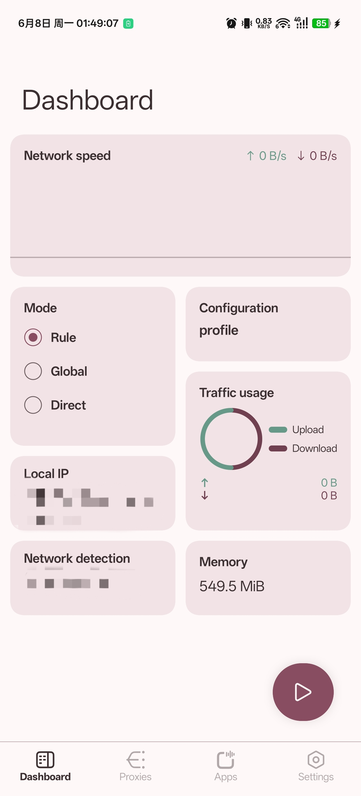
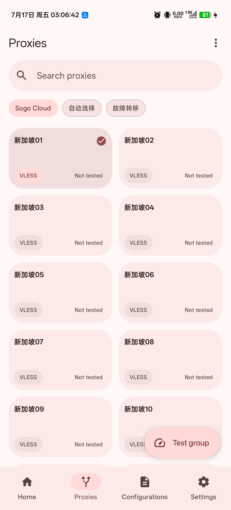
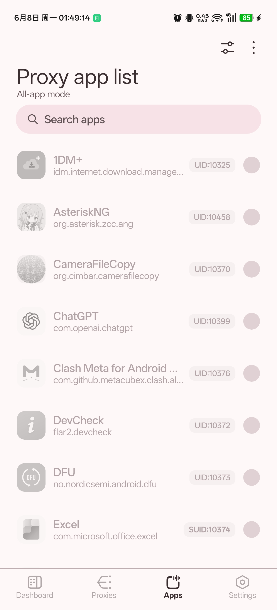
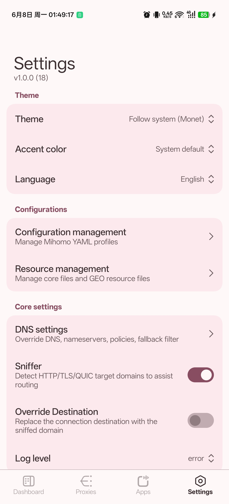

English | [简体中文](README_zh_CN.md)

# AsteriskMETA

An Android Mihomo GUI client powered by [Mihomo](https://github.com/MetaCubeX/mihomo), [CMFA Mihomo wrapper](https://github.com/MetaCubeX/ClashMetaForAndroid/tree/main/core), and [hev-socks5-tunnel](https://github.com/heiher/hev-socks5-tunnel).

## Telegram Channel

[Asterisk4Magisk](https://t.me/Asterisk4Magisk)

## Features

- VPN Service, TPROXY(ROOT), TUN(ROOT), TUN2SOCKS(ROOT), and BPF2SOCKS(ROOT) run modes
- Add configurations from QR code, local file, or URL subscription
- JavaScript override scripts for advanced configuration mutation
- ROOT start-on-boot script generation through Magisk `service.d`
- Material 3 Compose UI

## Screenshots

<p align="center">
  
  
  
  
</p>

## Run Modes

### VPN Service

- Works without root permission.
- Uses Android `VpnService`.
- Uses the CMFA bridge module to run Mihomo in the app process.
- Suitable for normal Android app-level VPN usage.

### TPROXY(ROOT)

- Requires root permission.
- Runs the local Mihomo executable directly with libsu.
- Uses iptables and policy routing for transparent proxy traffic.
- Uses the configured transparent proxy port as the Mihomo inbound.

### TUN(ROOT)

- Requires root permission.
- Runs the local Mihomo executable directly with libsu.
- Uses Mihomo's TUN listener to create the fixed TUN device `asterisk0`.
- Keeps Mihomo `auto-route` disabled and applies app-managed iptables and policy routing rules.
- Defaults to the gVisor TUN stack for compatibility; users can switch to another Mihomo TUN stack in settings.

### TUN2SOCKS(ROOT)

- Requires root permission.
- Runs the local Mihomo executable directly with libsu.
- Uses `hev-socks5-tunnel` to create the fixed TUN device `asterisk0`.
- Uses Mihomo's local SOCKS5 inbound as the tunnel target.
- Shares most ROOT routing and app proxy behavior with TPROXY, but routes traffic through the TUN device instead of Mihomo's TPROXY inbound.

### BPF2SOCKS(ROOT)

- Requires root permission.
- Runs the local Mihomo executable and native `bpf2socks` helper directly with libsu.
- Uses eBPF plus a local bridge to send TCP and UDP traffic to Mihomo's SOCKS5 inbound.
- Defaults to bridge port `65532` and SOCKS5 inbound port `65534`.
- Requires the eBPF probe to pass before startup. Devices with insufficient support cannot start this mode.

### ROOT address monitor

- All ROOT modes use the native `asteriskd` monitor after Mihomo and mode rules are ready.
- It tracks local IPv4/IPv6 address changes and atomically refreshes direct-bypass iptables chains or BPF maps, so public addresses are not accidentally captured by the proxy path.
- When system IPv6 disabling is enabled, it also applies the setting to newly appearing IPv6 interfaces. With IPv6 enabled, it reacts to configured tethering interfaces and removes Android IPv6 TC offload rules when needed.
- The monitor log is `files/clash/logs/asteriskd.log`; generated `files/clash/stop.sh` is the single ROOT stop entry point and restores captured IPv6 state before cleanup.

## Resource Files

- Runtime files are stored in the app private `files/clash` directory, commonly `/data/user/0/org.asterisk.zcc.ameta/files/clash`.
- The bundled Mihomo executable is restored from native libraries and can be replaced manually with an `mihomo` executable file.
- Custom resource files can be added, replaced manually, or updated from their configured URLs.

## Development

Initialize submodules before building:

```bash
git submodule update --init --recursive
```

Open the project root in Android Studio, or build it with Gradle wrapper:

```powershell
.\gradlew.bat assembleDebug
```

On macOS or Linux:

```bash
./gradlew assembleDebug
```

The build:

- uses Android SDK and NDK
- prepares bundled Mihomo native runtime files
- checks out the Mihomo submodule to `ProjectConfig.MIHOMO_CORE_VERSION` before CMFA JNI builds
- checks out `hev-socks5-tunnel` to `ProjectConfig.HEV_SOCKS5_TUNNEL_VERSION` before building it
- builds the native `hev-socks5-tunnel` JNI library and CLI runtime from the vendored submodule
- builds the vendored CMFA Go core
- builds the native `setuidgid`, `asteriskd`, and `bpf2socks` helpers
- produces ABI split APKs for `arm64-v8a`, `armeabi-v7a`, `x86`, `x86_64`, plus a universal APK

If Gradle cannot find Android NDK, set `ndk.dir` in `local.properties`, set `ANDROID_NDK_HOME`, or install an NDK under the Android SDK.

## WSA

For WSA, VPN permission can be granted with:

```bash
appops set org.asterisk.zcc.ameta ACTIVATE_VPN allow
```

## License

[GPL-3.0](LICENSE)

## Credits

- [Mihomo](https://github.com/MetaCubeX/mihomo)
- [ClashMetaForAndroid](https://github.com/MetaCubeX/ClashMetaForAndroid)
- [hev-socks5-tunnel](https://github.com/heiher/hev-socks5-tunnel)
- [libsu](https://github.com/topjohnwu/libsu)
- [Jetpack Compose Material 3](https://developer.android.com/develop/ui/compose/designsystems/material3)
