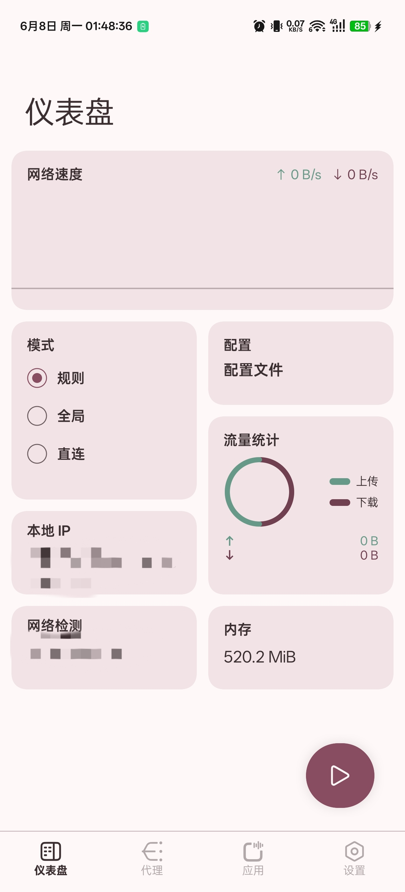
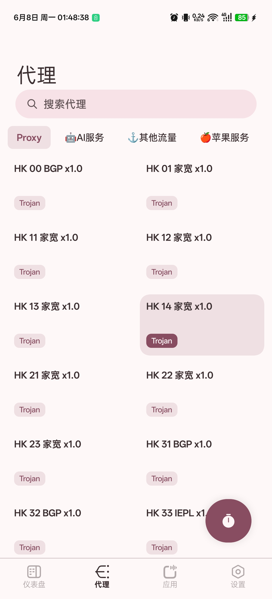
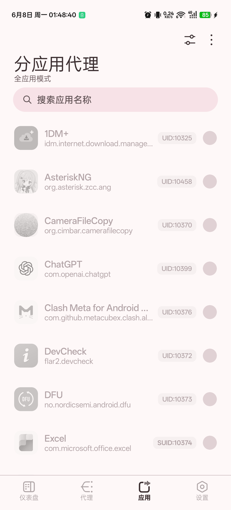
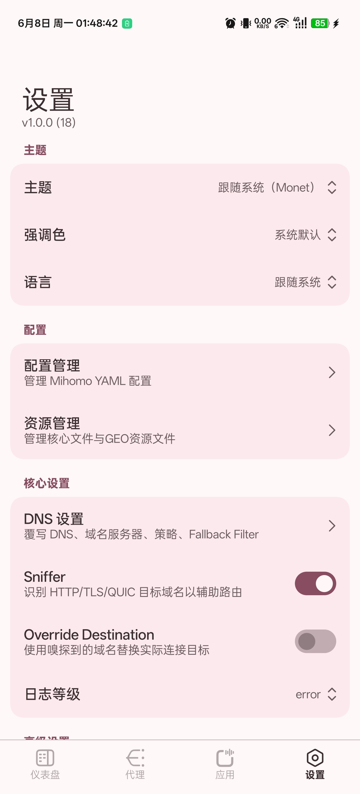

[English](README.md) | 简体中文

# AsteriskMETA

一个 Android Mihomo GUI 客户端，使用 [Mihomo](https://github.com/MetaCubeX/mihomo)、[CMFA Mihomo wrapper](https://github.com/MetaCubeX/ClashMetaForAndroid/tree/main/core) 和 [hev-socks5-tunnel](https://github.com/heiher/hev-socks5-tunnel) 实现。

## Telegram 频道

[Asterisk4Magisk](https://t.me/Asterisk4Magisk)

## 功能

- VPN Service、TPROXY(ROOT)、TUN(ROOT)、TUN2SOCKS(ROOT) 和 BPF2SOCKS(ROOT) 运行模式
- 支持通过二维码、本地文件、URL 订阅添加配置
- 支持 JavaScript 覆写脚本，用于进阶配置修改
- 通过 Magisk `service.d` 脚本支持 ROOT 模式开机自启
- MIUIX Compose UI

## 预览

<p align="center">
  
  
  
  
</p>

## 运行模式

### VPN Service

- 无需 root 权限。
- 使用 Android `VpnService`。
- 通过 CMFA bridge 模块在应用进程中运行 Mihomo。
- 适合常规 Android 应用级 VPN 使用场景。

### TPROXY(ROOT)

- 需要 root 权限。
- 通过 libsu 直接运行本地 Mihomo 可执行文件。
- 使用 iptables 和策略路由处理透明代理流量。
- 使用已配置的透明代理端口作为 Mihomo 入站。

### TUN(ROOT)

- 需要 root 权限。
- 通过 libsu 直接运行本地 Mihomo 可执行文件。
- 使用 Mihomo 的 TUN listener 创建固定 TUN 设备 `asterisk0`。
- 不启用 Mihomo `auto-route`，而是使用应用托管的 iptables 和策略路由规则。
- 默认使用 gVisor TUN 栈以优先保证兼容性，用户可以在设置中切换到其他 Mihomo TUN 栈。

### TUN2SOCKS(ROOT)

- 需要 root 权限。
- 通过 libsu 直接运行本地 Mihomo 可执行文件。
- 使用 `hev-socks5-tunnel` 创建固定 TUN 设备 `asterisk0`。
- 使用 Mihomo 的本地 SOCKS5 入站作为隧道目标。
- 与 TPROXY 共享大部分 ROOT 路由和应用代理行为，但流量会通过 TUN 设备转发，而不是通过 Mihomo 的 TPROXY 入站。

### BPF2SOCKS(ROOT)

- 需要 root 权限。
- 通过 libsu 直接运行本地 Mihomo 可执行文件和 native `bpf2socks` helper。
- 使用 eBPF 和本地 bridge 将 TCP、UDP 流量送入 Mihomo 的 SOCKS5 入站。
- 默认 bridge 端口为 `65532`，SOCKS5 入站端口为 `65534`。
- 启动前要求 eBPF probe 通过。设备支持不足时，该模式无法启动。

## 资源文件

- 运行时文件存储在应用私有的 `files/clash` 目录中，通常为 `/data/user/0/org.asterisk.zcc.ameta/files/clash`。
- 内置 Mihomo 可执行文件会从 native libraries 还原，也可以手动替换为 `mihomo` 可执行文件。
- 自定义资源文件可以手动添加、替换，或通过配置的 URL 更新。

## 开发

构建前初始化 submodule：

```bash
git submodule update --init --recursive
```

使用 Android Studio 打开项目根目录，或通过 Gradle wrapper 构建：

```powershell
.\gradlew.bat assembleDebug
```

macOS 或 Linux：

```bash
./gradlew assembleDebug
```

构建过程会：

- 使用 Android SDK 和 NDK
- 准备内置 Mihomo native 运行时文件
- 在 CMFA JNI 构建前将 Mihomo submodule checkout 到 `ProjectConfig.MIHOMO_CORE_VERSION`
- 构建前将 `hev-socks5-tunnel` checkout 到 `ProjectConfig.HEV_SOCKS5_TUNNEL_VERSION`
- 从 vendored submodule 构建 native `hev-socks5-tunnel` JNI library 和 CLI runtime
- 构建 vendored CMFA Go core
- 构建 native `setuidgid`、`ipv6disabler` 和 `bpf2socks` helper
- 产出 `arm64-v8a`、`armeabi-v7a`、`x86`、`x86_64` 四个 ABI split APK，以及一个 universal APK

如果 Gradle 找不到 Android NDK，请在 `local.properties` 中设置 `ndk.dir`，设置 `ANDROID_NDK_HOME`，或在 Android SDK 下安装 NDK。

## WSA

对于 WSA，可以使用以下命令授予 VPN 权限：

```bash
appops set org.asterisk.zcc.ameta ACTIVATE_VPN allow
```

## 许可

[GPL-3.0](LICENSE)

## 致谢

- [Mihomo](https://github.com/MetaCubeX/mihomo)
- [ClashMetaForAndroid](https://github.com/MetaCubeX/ClashMetaForAndroid)
- [hev-socks5-tunnel](https://github.com/heiher/hev-socks5-tunnel)
- [libsu](https://github.com/topjohnwu/libsu)
- [MIUIX](https://github.com/compose-miuix-ui/miuix)
